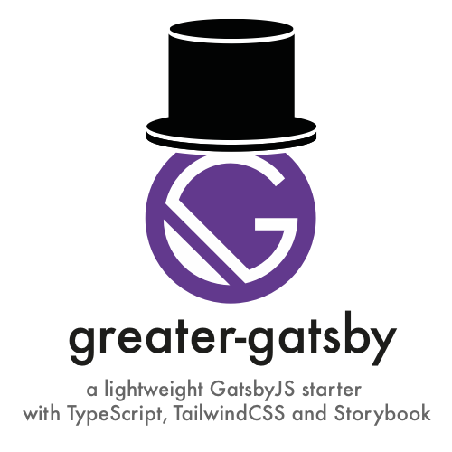

# greater-gatsby

> **BAREBONES** and **LIGHTWEIGHT** GatsbyJS Default Starter with Typescript, PostCSS, Storybook, & Tailwind CSS



## Features

**BAREBONES** and **LIGHTWEIGHT** GatsbyJS Default Starter, stripped of example styles and with the following additions:

- Storybook (latest)
- PostCSS
- TailwindCSS (v1.0+)
- TypeScript
- Styled Components (v5+)

Perfect for your best JAMStack projects in 2020 and beyond!

## Quick Start

```shell
gatsby new PROJECT_NAME https://github.com/rbutera/greater-gatsby
```

For a more detailed understanding on what's going on with this starter underneath the hood, check out the blog post written by [rbutera](https://github.com/rbutera) on Medium:

[BLOG POST: JAMStack Tutorial Part 1: GatsbyJS with Storybook, TailwindCSS, and Typescript Setup on Medium.com](https://medium.com/@rbutera/jamstack-tutorial-part-1-gatsbyjs-with-storybook-tailwindcss-and-typescript-setup-bd28855db897)

## Development Instructions

### Starting the Development Server

To install all the required dependencies using **Yarn**, run `yarn install`

Then you can start the development server:


```shell
gatsby develop
```

By default the development server will be running on port 3000, so to visit it open a browser and go to [https://localhost:3000](https://localhost:3000)


### Component Development Using Storybook
To develop components, run Storybook:

```
yarn storybook
```
By default Storybook runs on will be running on port 6006, so to visit it open a browser and go to [https://localhost:6006](https://localhost:6006)


## Project Structure

We have included an example `<Logo />` component (complete with an example storybook story).

You can check these out at:
[./src/components/logo.tsx](./src/components/logo.tsx)
[./src/components/logo.stories.tsx](./src/components/logo.stories.tsx)

Only the configuration files (see the blog post) and the below files are actually different to the default Gatsby starter.

If you're comfortable working with the default gatsby starter then this starter will be right up your street! :smile:

```shell
src
├── components
│   ├── header.tsx # only slightly modified
│   ├── layout.css # now empty, ready for your customizations
│   ├── logo.stories.tsx # EXAMPLE COMPONENT STORY
│   ├── logo.tsx # EXAMPLE COMPONENT
├── global-style.tsx # global styles go here, and are used by both your Gatsby application and Storybook
└── tailwind.css # tailwind preflight
```

## Plans for Future Development

- We intend to keep this starter lightweight, but also add some further opinionated customizations
- We admire the work in [gatsby-universal](https://github.com/fabe/gatsby-universal) and so we'll probably steal some of the features of that starter for this one.

## Roadmap and TODO

- [x] add typescript
- [x] add postCSS
- [x] remove default styles
- [x] remove default styles
- [x] write blog post
- [ ] create a good looking starter template
- [ ] link to projects using this starter
- [ ] add unit tests
- [ ] add generation of favicons
- [ ] add other features from [gatsby-universal](https://github.com/fabe/gatsby-universal)


## Contribution

All contributions / suggestions are very very welcome! Please open an issue, PR or send an email to rbutera ([rai@rstlss.org](mailto:rai@rstlss.org))
